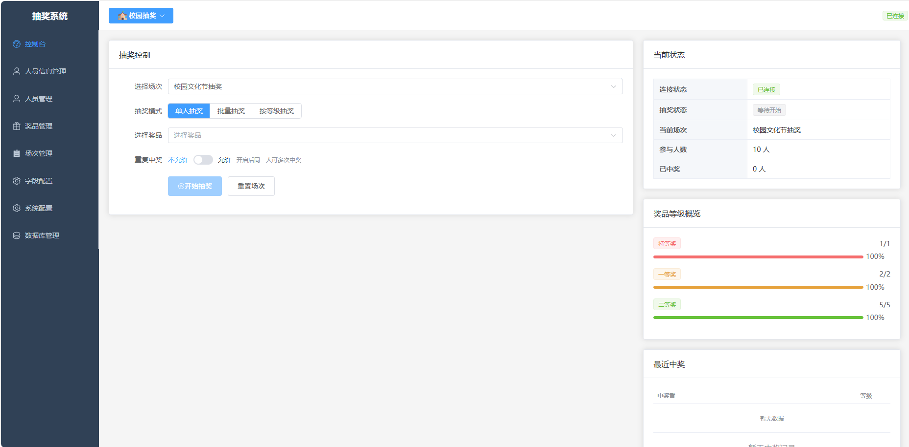
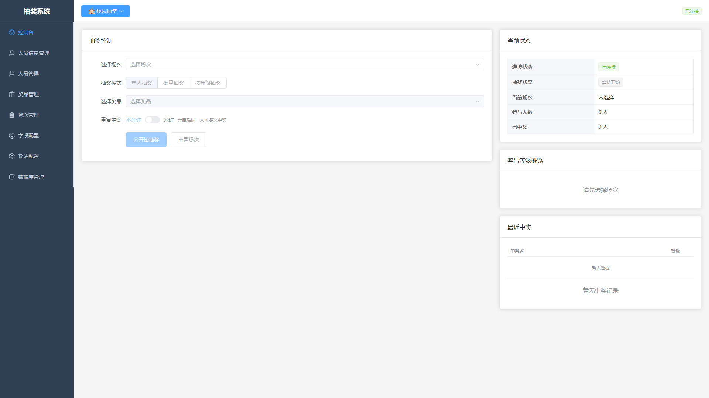
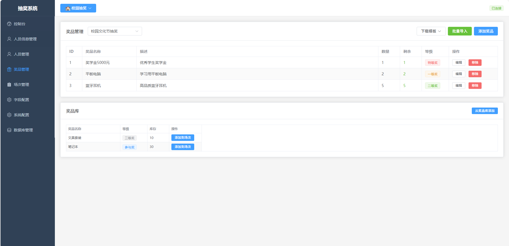
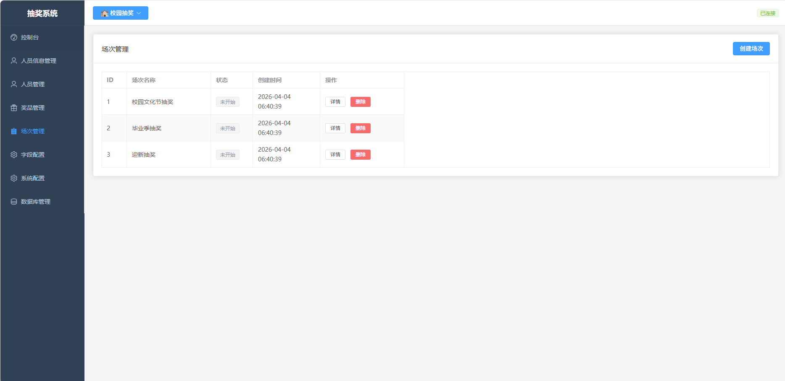
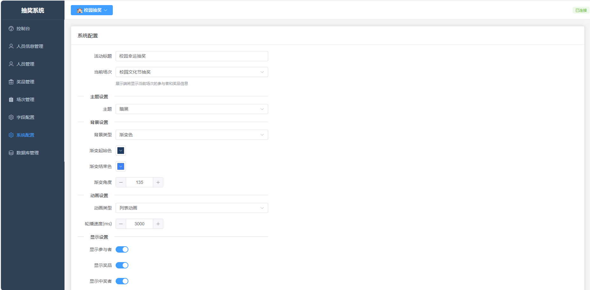
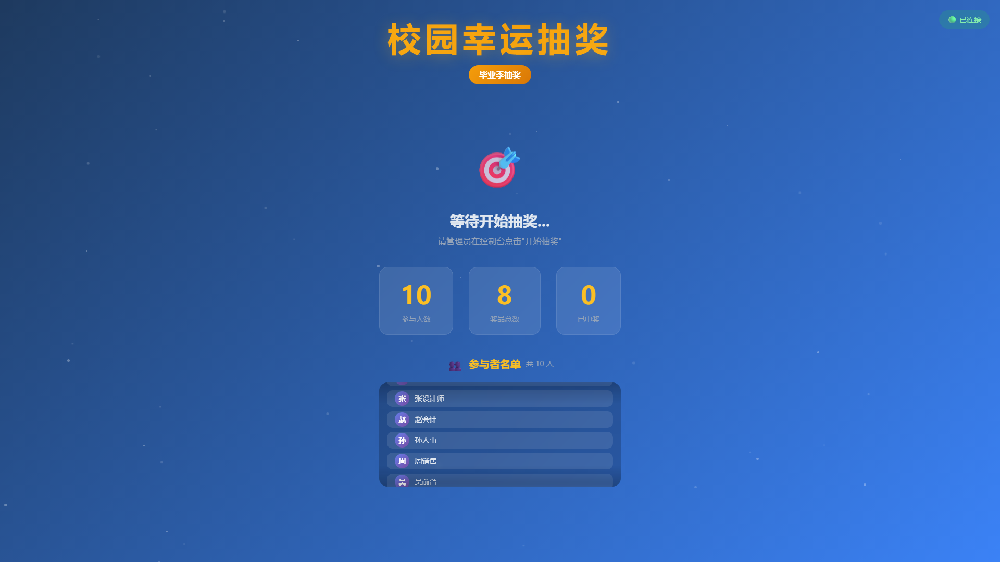

# 抽奖系统使用说明

**版本**: v1.0.0 | **日期**: 2026-04-04

## 目录

1. [系统概述](#1-系统概述)
2. [环境要求](#2-环境要求)
3. [安装部署](#3-安装部署)
4. [快速开始](#4-快速开始)
5. [管理后台使用指南](#5-管理后台使用指南)
6. [抽奖展示端使用指南](#6-抽奖展示端使用指南)
7. [常见问题](#7-常见问题)

---

## 1. 系统概述

抽奖系统是一个功能完善的企业级抽奖活动管理平台，支持人员管理、奖品管理、场次管理、抽奖控制和实时展示等功能。系统采用前后端分离架构，包含三个独立应用：

| 应用 | 端口 | 说明 |
|------|------|------|
| 后端服务 | 3000 | 提供 REST API 和 WebSocket 服务 |
| 管理后台 | 5173 | 管理员操作界面 |
| 展示端 | 5174 | 大屏展示抽奖动画 |

### 系统架构

```
┌─────────────────────────────────────────────────────────────┐
│                        客户端层                              │
├─────────────────────────────────────────────────────────────┤
│  ┌──────────────────┐      ┌──────────────────────────┐    │
│  │   管理后台        │      │   抽奖展示端              │    │
│  │   (Vue 3 SPA)    │      │   (Vue 3 应用)           │    │
│  │   localhost:5173 │      │   localhost:5174         │    │
│  └────────┬─────────┘      └────────────┬─────────────┘    │
│           │ HTTP REST                WebSocket              │
├───────────┼──────────────────────────────┼──────────────────┤
│           │        服务端层              │                  │
├───────────┼──────────────────────────────┼──────────────────┤
│           ▼                              ▼                  │
│  ┌──────────────────────────────────────────────────────┐   │
│  │              Express.js Server (Port 3000)            │   │
│  │         REST API + Socket.io WebSocket               │   │
│  └──────────────────────────┬───────────────────────────┘   │
├─────────────────────────────┼───────────────────────────────┤
│                             │         数据层                 │
├─────────────────────────────┼───────────────────────────────┤
│                             ▼                               │
│  ┌──────────────────────────────────────────────────────┐   │
│  │                   SQLite 3 Database                   │   │
│  └──────────────────────────────────────────────────────┘   │
└─────────────────────────────────────────────────────────────┘
```

---

## 2. 环境要求

### 2.1 软件要求

| 软件 | 版本要求 | 说明 |
|------|----------|------|
| Node.js | >= 18.0.0 | JavaScript 运行时 |
| npm | >= 9.0.0 | 包管理器 |
| Git | >= 2.0.0 | 版本控制（可选） |

### 2.2 浏览器支持

| 浏览器 | 最低版本 |
|--------|----------|
| Chrome | 80+ |
| Edge | 80+ |
| Firefox | 80+ |
| Safari | 14+ |

### 2.3 硬件建议

- CPU: 双核及以上
- 内存: 4GB 及以上
- 显示器: 推荐 1920x1080 或更高分辨率

---

## 3. 安装部署

### 3.1 获取项目

```bash
# 克隆项目（如果使用 Git）
git clone <项目地址>
cd lottery-system
```

### 3.2 安装依赖

```bash
# 安装后端依赖
cd backend
npm install

# 安装管理后台依赖
cd ../admin
npm install

# 安装展示端依赖
cd ../display
npm install
```

### 3.3 启动服务

#### 方式一：分别启动（开发模式）

```bash
# 终端1 - 启动后端服务
cd backend
npm run dev

# 终端2 - 启动管理后台
cd admin
npm run dev

# 终端3 - 启动展示端
cd display
npm run dev
```

#### 方式二：使用监控脚本（生产模式）

```bash
cd monitor
python monitor.py
```

监控脚本会自动启动所有服务并在服务异常时自动重启。

### 3.4 验证安装

启动成功后，访问以下地址验证：

- 后端 API: http://localhost:3000/api/participants
- 管理后台: http://localhost:5173
- 展示端: http://localhost:5174

---

## 4. 快速开始

### 4.1 完整抽奖流程

按照以下步骤完成一次完整的抽奖活动：

```
步骤1: 导入参与者名单
    ↓
步骤2: 创建奖品
    ↓
步骤3: 创建抽奖场次
    ↓
步骤4: 为场次关联参与者和奖品
    ↓
步骤5: 打开展示端大屏
    ↓
步骤6: 在控制台开始抽奖
    ↓
步骤7: 查看中奖结果
```

### 4.2 快速操作指南

1. **打开管理后台**: 浏览器访问 http://localhost:5173
2. **添加参与者**: 点击左侧菜单「人员管理」→「添加人员」或「批量导入」
3. **创建奖品**: 点击左侧菜单「奖品管理」→「添加奖品」
4. **创建场次**: 点击左侧菜单「场次管理」→「创建场次」
5. **关联数据**: 进入场次详情，添加参与者和奖品
6. **开始抽奖**: 点击左侧菜单「控制台」，选择场次和奖品，点击「开始抽奖」

---

## 5. 管理后台使用指南

### 5.1 界面概览

管理后台采用左侧导航 + 右侧内容区的经典布局：



**界面说明：**

| 区域 | 功能 |
|------|------|
| 左侧导航栏 | 系统功能菜单 |
| 顶部栏 | 系统标题、刷新按钮、全屏按钮 |
| 主内容区 | 当前页面的操作界面 |

### 5.2 控制台（Dashboard）

控制台是抽奖的核心操作界面，包含抽奖控制面板和状态监控。

**功能区域：**

1. **场次选择**: 下拉选择当前抽奖场次
2. **奖品选择**: 下拉选择当前抽取的奖品
3. **控制按钮**: 开始/暂停/停止/重置
4. **状态显示**: 连接状态、抽奖状态、已中奖人数
5. **活动日志**: 显示最近的操作记录

**操作流程：**

```
1. 选择场次 → 2. 选择奖品 → 3. 点击「开始抽奖」
     ↓
4. 展示端开始动画 → 5. 点击「停止抽奖」→ 6. 显示中奖结果
     ↓
7. 点击「重置」准备下一轮
```

### 5.3 人员管理

人员管理页面用于管理参与抽奖的人员信息。



**功能说明：**

| 功能 | 操作方式 | 说明 |
|------|----------|------|
| 添加人员 | 点击「添加人员」按钮 | 手动录入单个参与者 |
| 批量导入 | 点击「批量导入」按钮 | 通过 Excel 文件批量导入 |
| 编辑人员 | 点击操作列「编辑」 | 修改人员信息 |
| 删除人员 | 点击操作列「删除」 | 删除单个人员 |
| 黑名单 | 点击「黑名单」按钮 | 将人员加入/移出黑名单 |

**批量导入说明：**

Excel 文件格式要求：
- 必须包含 `name` 列（姓名）
- 可选列：`email`（邮箱）、`phone`（电话）、`weight`（权重）

示例 Excel 格式：

| name | email | phone | weight |
|------|-------|-------|--------|
| 张三 | zhangsan@example.com | 13800138000 | 1 |
| 李四 | lisi@example.com | 13900139000 | 2 |

**黑名单功能：**

- 被加入黑名单的人员不会参与抽奖
- 黑名单状态可在人员列表中直接切换
- 黑名单人员会显示特殊标记

### 5.4 奖品管理

奖品管理页面用于管理抽奖活动的奖品信息。



**功能说明：**

| 功能 | 操作方式 | 说明 |
|------|----------|------|
| 添加奖品 | 点击「添加奖品」按钮 | 创建新奖品 |
| 编辑奖品 | 点击奖品卡片「编辑」 | 修改奖品信息 |
| 删除奖品 | 点击奖品卡片「删除」 | 删除奖品 |
| 上传图片 | 编辑时上传图片 | 支持jpg/png/gif，最大10MB |

**奖品属性：**

| 属性 | 必填 | 说明 |
|------|------|------|
| 名称 | 是 | 奖品名称 |
| 描述 | 否 | 奖品描述信息 |
| 图片 | 否 | 奖品图片 |
| 可抽次数 | 是 | 该奖品可被抽取的次数 |

### 5.5 场次管理

场次是抽奖活动的容器，每个场次可以关联一组参与者和奖品。



**场次列表：**

显示所有场次的基本信息，包括：
- 场次名称
- 场次描述
- 参与者数量
- 奖品数量
- 场次状态（未开始/进行中/已结束）

**场次详情：**

点击场次可进入详情页面，进行以下操作：


1. **参与者管理**: 为场次添加/移除参与者
2. **奖品管理**: 为场次添加/移除奖品
3. **中奖记录**: 查看该场次的所有中奖记录

### 5.6 系统配置

系统配置页面用于设置展示端的显示效果。



**配置项说明：**

| 配置项 | 说明 |
|--------|------|
| 主题选择 | 6种预设主题：暗夜黑、简约白、海洋蓝、森林绿、落日橙、梦幻紫 |
| 背景设置 | 支持渐变、纯色、图片三种背景类型 |
| 动画设置 | 选择动画类型（网格/球体/列表）和轮播速度 |
| 标题设置 | 自定义展示端显示的活动标题 |

---

## 6. 抽奖展示端使用指南

### 6.1 界面概览

展示端是面向观众的大屏展示界面，用于实时展示抽奖动画和中奖结果。



**界面元素：**

| 元素 | 说明 |
|------|------|
| 活动标题 | 显示配置的活动名称 |
| 参与者轮播 | 滚动显示参与者姓名 |
| 动画区域 | 抽奖时显示动画效果 |
| 中奖展示 | 显示中奖者信息和奖品 |
| 连接状态 | 显示与服务器的连接状态 |

### 6.2 动画模式

系统支持三种动画模式：

| 模式 | 效果描述 |
|------|----------|
| Grid（网格） | 3x3网格布局，高亮格子快速跳动 |
| Sphere（球体） | 3D球体效果，参与者姓名分布在球面旋转 |
| List（列表） | 纵向列表展示，高亮项快速滚动 |

### 6.3 中奖特效

中奖时会触发以下特效：

1. 彩带飘落效果
2. 中奖者姓名放大显示
3. 奖品信息渐入展示
4. 背景闪光效果

### 6.4 连接状态

展示端左下角显示连接状态指示器：

| 状态 | 颜色 | 说明 |
|------|------|------|
| 已连接 | 绿色 | 与服务器正常连接 |
| 连接中 | 黄色 | 正在尝试连接 |
| 断开连接 | 红色 | 与服务器断开 |

### 6.5 全屏模式

展示端支持全屏模式，适合大屏展示：

- 按 `F11` 键进入/退出全屏
- 或点击浏览器菜单选择全屏

---

## 7. 常见问题

### 7.1 服务启动问题

**Q: 后端启动失败，提示端口被占用？**

A: 检查3000端口是否被其他程序占用：
```bash
# Windows
netstat -ano | findstr :3000

# 结束占用进程或修改后端端口
```

**Q: 前端启动后无法访问后端API？**

A: 检查后端服务是否正常运行，确认后端在3000端口启动。

### 7.2 抽奖操作问题

**Q: 点击开始抽奖没有反应？**

A: 检查以下几点：
1. 是否已选择场次和奖品
2. 场次是否已关联参与者和奖品
3. 奖品库存是否充足
4. 展示端是否已连接

**Q: 展示端没有显示动画？**

A: 检查以下几点：
1. 展示端是否与服务器连接正常
2. 刷新展示端页面
3. 检查浏览器控制台是否有错误

### 7.3 数据导入问题

**Q: Excel导入失败？**

A: 检查以下几点：
1. Excel文件格式是否正确（.xlsx或.xls）
2. 是否包含必填的name列
3. 数据是否有特殊字符

### 7.4 网络问题

**Q: 展示端显示断开连接？**

A: 
1. 检查后端服务是否运行
2. 检查网络连接
3. 刷新展示端页面

---

## 附录

### A. 快捷键

| 快捷键 | 功能 | 适用页面 |
|--------|------|----------|
| F11 | 全屏切换 | 全局 |
| Escape | 关闭弹窗 | 管理后台 |
| Space | 开始/停止抽奖 | 控制台 |

### B. API 端点

| 端点 | 方法 | 说明 |
|------|------|------|
| /api/participants | GET/POST | 参与者列表/创建 |
| /api/prizes | GET/POST | 奖品列表/创建 |
| /api/sessions | GET/POST | 场次列表/创建 |
| /api/console/start | POST | 开始抽奖 |
| /api/console/stop | POST | 停止抽奖 |
| /api/console/reset | POST | 重置抽奖 |

### C. 技术支持

如遇问题，请检查：
1. 浏览器控制台错误信息
2. 后端服务日志
3. 网络请求状态
